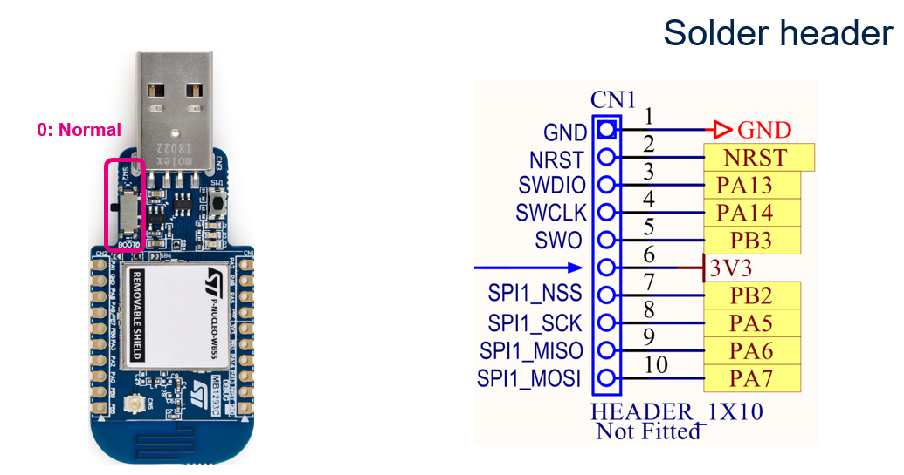
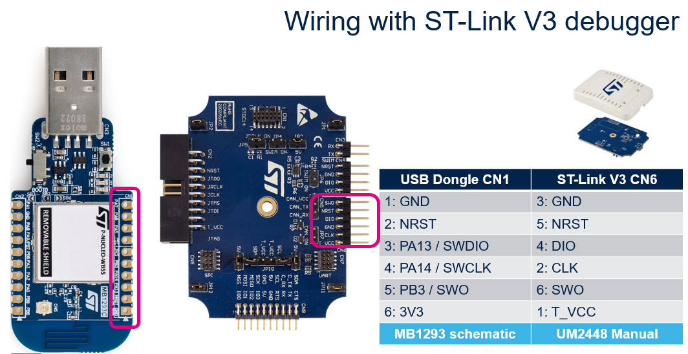
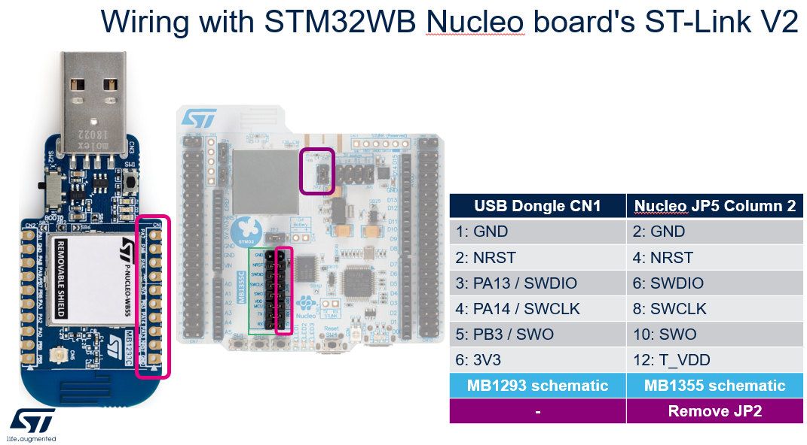
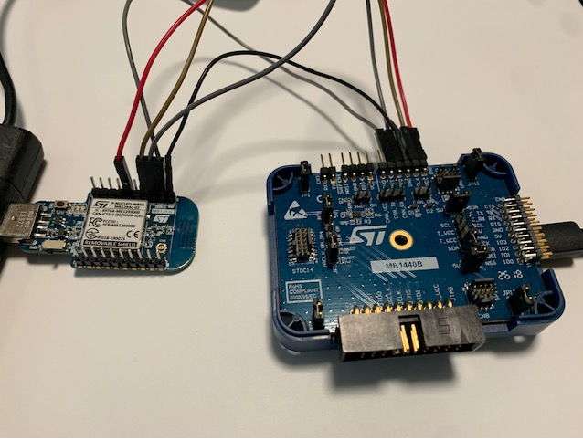
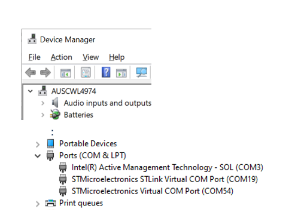
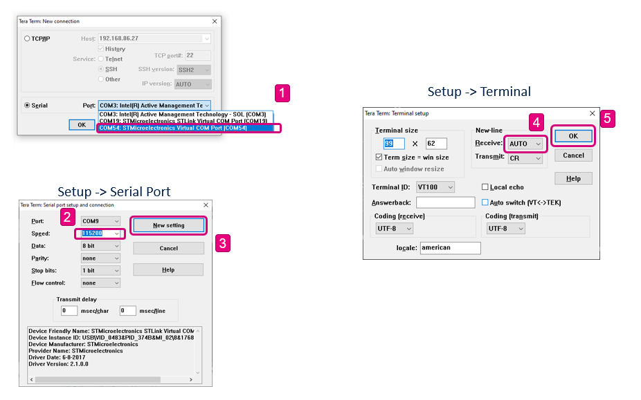
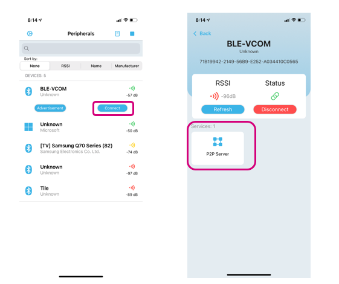
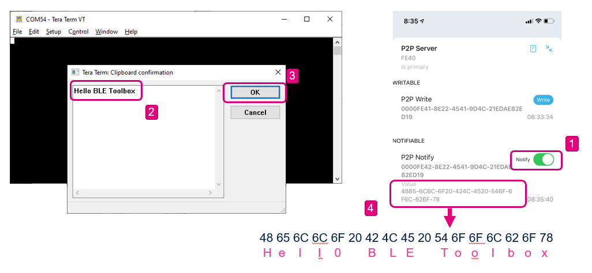
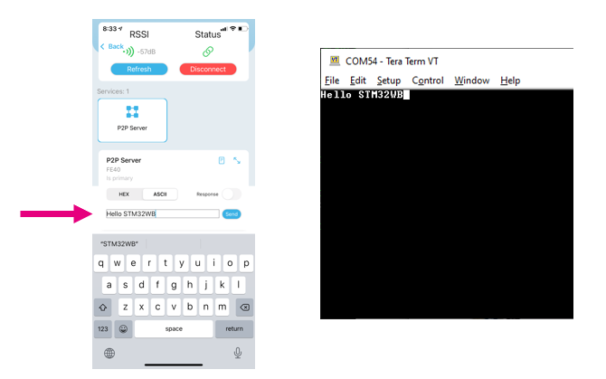

# STM32-Hotspot/STM32WB-BLE-USB-CDC-VCOM MCU Firmware Package, based on STM32CubeWB Release v1.13.3

## Example

This Hotspot FW package includes:
* Application example under "Projects\P-NUCLEO-WB55.USBDongle\Applications\BLE" called STM32WB-BLE-USB-CDC-VCOM.     
	* This examle demonstrates how to use the BLE component alongside the USB peripheral for point-to-point communications. The application runs the BLE component as a GAP Peripheral and GATT Server, and the USB as a Device Communication Class (CDC), this is a typical application on how to use the STM32WBxx USB Device peripheral where the STM32WB MCU behaves as a USB-to-RS232 bridge following the Virtual COM Port (VCP) implementation.
	- On one side, the STM32 exchanges data with a PC host through USB interface in Device mode (VCP).
	- On the other side, the STM32 exchanges data with other devices through the BLE interface.
    * When the VCP application is started, the STM32 MCU is enumerated as serial communication port and is
	configured in the same way (baudrate, data format, parity, stop bit) as it would configure a standard 
	COM port.    
	* The STM32WBxx device acts as a GAP peripheral and GATT Server, and will start to advertise as a connectable device. 
	* The example also aims to demonstrate to the user how to configure the system (pinout, clocks, peripherals, utilities), USB and BLE WPAN middleware from STM32CubeMX to properly configure the BLE and USB stacks, and show how to schedule data transfers via Notifications and Write commands from the user application.       
   * Development tools, toolchains/compilers: STM32CubeMX v6.5.0, IAR EWARM V9.20.x, STM32CubeIDE v1.8.0
   * Supported Devices and hardware boards: NUCLEO-WB55.USBDongle
   * Known limitations: None

## Boards Needed

  * One NUCLEO-WB55.USBDongle
    * [NUCLEO-WB55.USBDongle](https://www.st.com/en/evaluation-tools/p-nucleo-wb55.html)

## User's Guide

* [1] Wire the SWD interface of the NUCLEO-WB55.USBDongle to an ST-link debugger (i.e. one from a NUCLEO-WB55RG, ST-LINK/V2, STLINK-V3SET, etc). This will allow the user to load code onto the target NUCLEO-WB55.USBDongle board and debug the code from an IDE

* [2] Connect the NUCLEO-WB55.USBDongle to one of the USB ports of a PC. Both NUCLEO-WB55.USBDongle and ST-link debugger should be connected to the same PC 

* [3] Open the code project with IAR EWARM or STM32CubeIDE and build the project 
* [4] Download the code on the STM32WB55xx board and execute it
* [5] The NUCLEO-WB55.USBDongle will enumerate as a USB Virtual COM port
	* Open a serial Terminal (TeraTerm, Putty, etc) and connect it to the board's VCOM port 
	

	
* [6] The NUCLEO-WB55.USBDongle will also start to advertise 
	* Open a BLE app (i.e. ST BLE Toolbox, Punchthrough Light Blue) from a smart mobile device and connect to the device named "STM32WB-BLE-VCOM" 
	
	
	
* [7] Once connected to the serial terminal and the BLE app, the user can transfer data between the STM32WB board and the serial terminal. 

	* On the serial terminal window, the user can type the characters to send to the mobile BLE app (GATT Client). 

	

	* On the mobile app, the user can type the characters to send to the STM32WB ((GATT Server)) and view the received from the serial terminal.

	
  

## Troubleshooting

**Caution** : Issues and the pull-requests are **not supported** to submit problems or suggestions related to the software delivered in this repository. The STM32WB-BLE-USB-CDC-VCOM example is being delivered as-is, and not necessarily supported by ST.

**For any other question** related to the product, the hardware performance or characteristics, the tools, the environment, you can submit it to the **ST Community** on the STM32 MCUs related [page](https://community.st.com/s/topic/0TO0X000000BSqSWAW/stm32-mcus).
